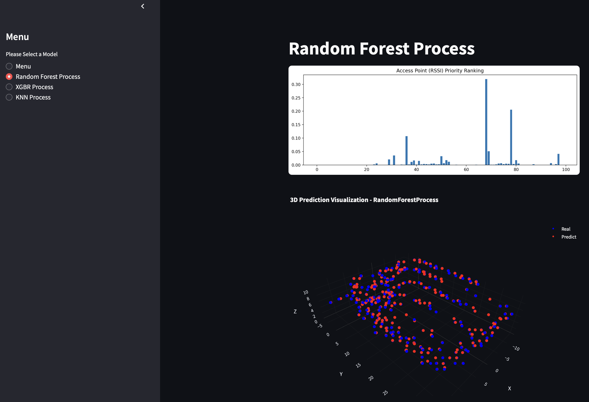

# 📌 3D Position Estimation using WiFi Fingerprinting


## 📌 Project Overview

This project focuses on estimating **3D positions** based on WiFi fingerprinting signal strengths using machine learning models.

> 🎯 **Goal:** Predict the (x, y, z) coordinates of a device using RSSI data with various regression models and visualize the results.

### 🧰 Models Used:
- 🎄 **Random Forest Regressor**
- 📍 **K-Nearest Neighbors (KNN)**
- 🚀 **XGBoost Regressor (XGBR)**

The system provides:
- 📊 **Model evaluation with 3D visualizations**
- 📌 **Feature importance analysis (when supported by the model)**  


```
## wifi-3d-positioning-project/
├── main.py                  # Main script: runs the application and predictions
├── position_estimation.py   # Model definitions, training, and testing logic
├── plot/                    # Generated plots and visualizations
│   ├── RandomForestProcess.png
│   ├── XGBRProcess.png
│   ├── KNNProcess.png
│   ├── Importance_for_KNN.png
│   └── Importance.png
├── media/                   # Screenshots used in the README file
│   ├── ss1.png
│   ├── ss2.png
│   ├── ss3.png
│   └── ss4.png
├── requirements.txt         # List of Python dependencies
└── README.md                # Project description and documentation

```

---

## 🎯 KNN Model and Feature Importance

### ✅ Approach:
- Multi-output regression was applied in the KNN model to predict three target variables (**x**, **y**, **z**) simultaneously.
- While Random Forest and XGBoost support direct feature importance extraction, **KNN does not provide a native `feature_importances_` attribute**.

### ⚠️ Permutation Importance Issue:
- Attempted to use `permutation_importance` from Scikit-learn.
- **Scikit-learn’s `permutation_importance` does not support multi-output models.**
- Error encountered:
  ```
  ValueError: y_true and y_pred have different number of output (1 != 3)
  ```
- This is a known limitation of the library.

### 🚩 Decision:
- Importance calculation was skipped for the KNN model.
- KNN was used purely for **prediction without feature selection**.

---

## 🖼️ Visualization Examples

### 🌲 Random Forest Regressor Visualization:


### 🚀 XGBoost Regressor Visualization:


### 📍 K-Nearest Neighbors (KNN) Visualization:


### 🏠 Project Main Menu Screenshot:


---

## 🛠️ Requirements
```plaintext
numpy
pandas
scikit-learn
xgboost
matplotlib
plotly
streamlit
openpyxl
```

---


## 📂 Installation

1. Clone the repository:
```bash
> git clone https://github.com/BurakCANKURT/wifi-3d-positioning-project.git

> cd wifi-3d-positioning-project
```

2. (Optional but recommended) Create and activate a virtual environment:
```bash
> python -m venv venv

# For Linux/Mac:
source venv/bin/activate

# For Windows:
venv\Scripts\activate
```

3. Install the required packages:
```bash
pip install -r requirements.txt
```

---
## 🚀 How to Run
```
> streamlit run main.py

```

---
## 🏁 Conclusion
The KNN model was successfully implemented for multi-output regression **without feature selection** due to library limitations regarding permutation importance. The other models (Random Forest and XGBoost) were able to utilize feature importance effectively.

This approach was documented transparently to reflect the decisions taken throughout the project.
---
## 📌 What I Learned

- Working with **multi-output regression models** for predicting 3D positions (x, y, z coordinates) from WiFi signal data.
- Handling model limitations such as the lack of feature importance support in KNN and understanding alternative approaches (e.g., permutation importance).
- Comparing the performance of different regression algorithms (Random Forest, KNN, XGBoost) and selecting the most effective one based on evaluation metrics.
- Designing a clear machine learning pipeline for model training, testing, and result visualization.
- Building an interactive application using Streamlit to present model outputs with 3D visualizations.

