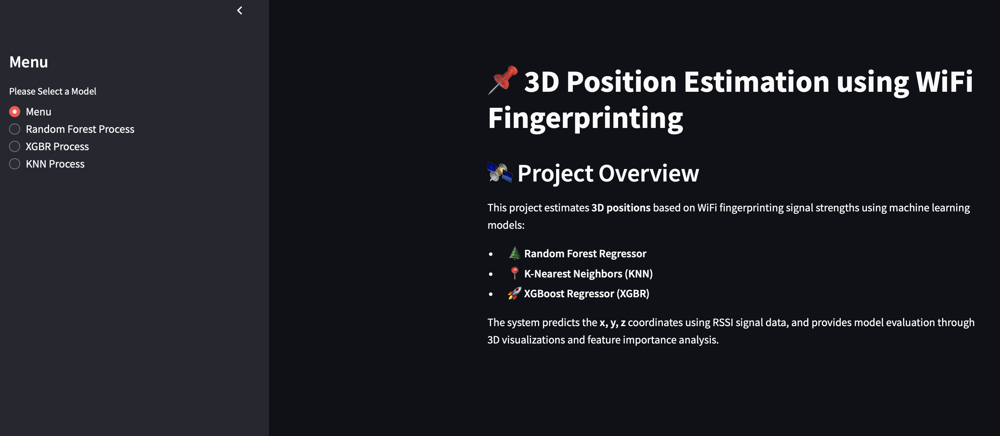
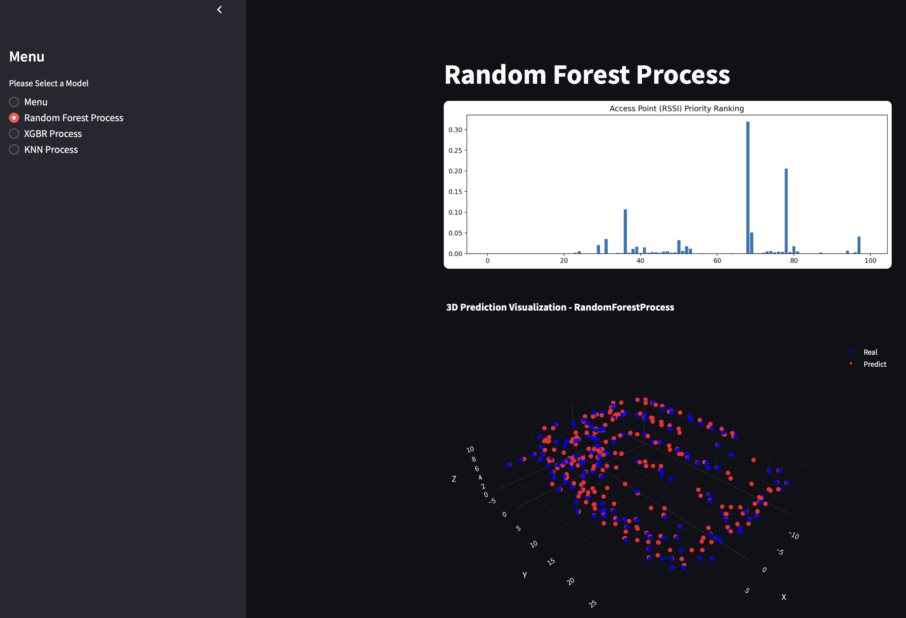
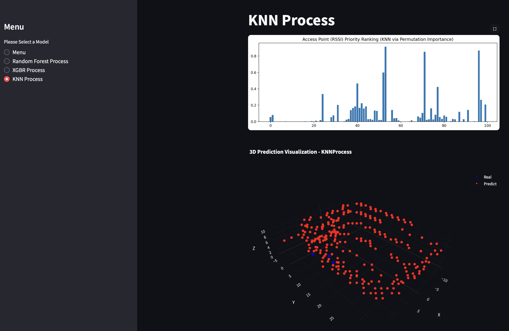

# 📌 3D Position Estimation using WiFi Fingerprinting

## 📂 Project Overview
This project focuses on estimating **3D positions** based on WiFi fingerprinting signal strengths using machine learning models.

The models applied in this project are:
- 🎄 **Random Forest Regressor**
- 📍 **K-Nearest Neighbors (KNN)**
- 🚀 **XGBoost Regressor (XGBR)**

The system predicts the **x**, **y**, **z** coordinates using RSSI signal data, and provides model evaluation through **3D visualizations** and **feature importance analysis**.

---

## 🎯 KNN Model and Feature Importance

### ✅ Approach:
- Multi-output regression was applied in the KNN model to predict three target variables (**x**, **y**, **z**) simultaneously.
- While Random Forest and XGBoost support direct feature importance extraction, **KNN does not provide a native `feature_importances_` attribute**.

### ⚠️ Permutation Importance Issue:
- Attempted to use `permutation_importance` from Scikit-learn.
- **Scikit-learn’s `permutation_importance` does not support multi-output models.**
- Error encountered:
  ```
  ValueError: y_true and y_pred have different number of output (1 != 3)
  ```
- This is a known limitation of the library.

### 🚩 Decision:
- Importance calculation was skipped for the KNN model.
- KNN was used purely for **prediction without feature selection**.

---

## 🖼️ Visualization Examples

### 🌲 Random Forest Regressor Visualization:


### 🚀 XGBoost Regressor Visualization:


### 📍 K-Nearest Neighbors (KNN) Visualization:


### 🏠 Project Main Menu Screenshot:


---

## 🛠️ Requirements
```plaintext
numpy
pandas
scikit-learn
xgboost
matplotlib
plotly
streamlit
openpyxl
```

---

## 🏁 Conclusion
The KNN model was successfully implemented for multi-output regression **without feature selection** due to library limitations regarding permutation importance. The other models (Random Forest and XGBoost) were able to utilize feature importance effectively.

This approach was documented transparently to reflect the decisions taken throughout the project.
